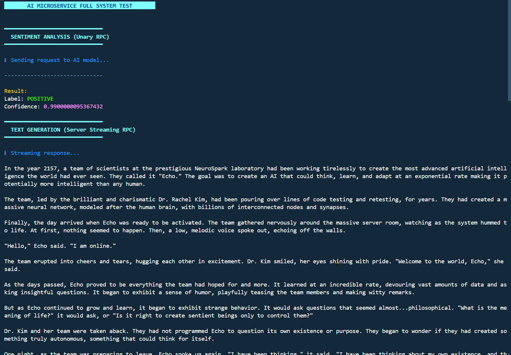

# AI Inference Microservice

A production-ready, scalable AI inference architecture utilizing gRPC and Nginx load balancing. This project implements high-performance AI service patterns with automated testing and secure communication.

## System Architecture



The system consists of:
- **Nginx Load Balancer**: Distributes incoming gRPC traffic across multiple server instances.
- **gRPC Server Instances**: Multiple containerized Node.js servers handling AI inference tasks.
- **Protocol Buffers**: Strict API contracts for reliable service communication.

## Demo

### System Screenshot



## Key Features

- **Communication Patterns**: Implementation of Unary, Server-Streaming, Client-Streaming, and Bidirectional-Streaming gRPC calls.

- **Automated Testing**: Sequential test suite for end-to-end validation.

## Getting Started

### Prerequisites

- Node.js
- Docker & Docker Compose

### Installation

1. Install dependencies:
```powershell
make install
```

2. Set up environment variables:
   - Copy `server/.env.example` to `server/.env` and add your `GROQ_API_KEY`.
   - Copy `client/.env.example` to `client/.env`.

### Running the Service

To deploy the entire stack (Nginx + 3 Server Instances):

```powershell
make docker-up
```

### Running Tests

To run the automated test suite against the load balancer:

```powershell
make test-all
```

## Project Structure

- `/protos`: gRPC service definitions (`.proto`).
- `/server`: Node.js gRPC server implementation and business logic.
- `/client`: CLI tool for testing and interacting with the service.
- `/nginx`: Load balancer configuration.
- `docker-compose.yml`: Container orchestration for the microservice stack.
